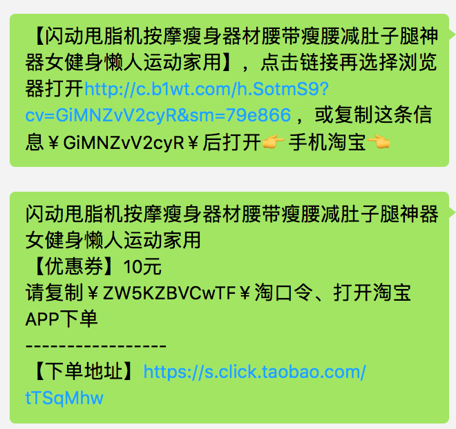

# wx_taobao_fanli
微信 淘宝 返利

---
20171030 更新

兼容python3

---

这个一个微信淘宝返利"机器人"，登录以后，匹配到淘宝口令会自动生成可以返利的淘宝口令。

功能上主要有两部分：
#### 微信
网上有现成的，非常感谢 [ItChat](https://github.com/littlecodersh/ItChat)。
#### 淘宝
在网上没搜到，自己抓包实现了。大概的过程是：
```
1、登录阿里妈妈
2、根据url搜索相关的商品
3、生成返利的商品口令
```

#### 依赖
```
requests
itchat
```

#### 使用
#####docker运行
项目根目录下执行
```
# 编译镜像
docker build -t xsren/wx_tb_fanli .
# 运行容器
docker run -ti xsren/wx_tb_fanli
```
也可以直接拉取我的镜像
```
 docker pull xsren/wx_tb_fanli
```
#####命令行运行
```
python main.py
```
第一次运行会扫两次码，第一个码是淘宝的码，用于登录淘宝，第二个是微信的码，用于登录微信。
需要注意的是淘宝账号必须认证才能使用淘宝联盟。

#### 效果图



TODO:
- [] GUI
- [] 更好的错误反馈
- [] 可配置


欢迎大家提issue